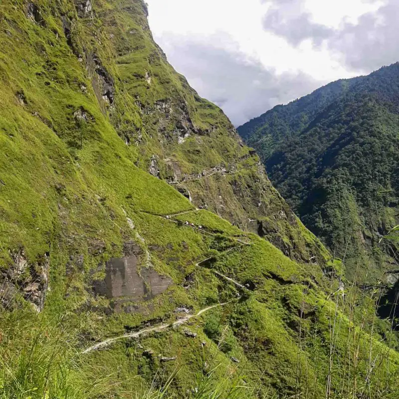
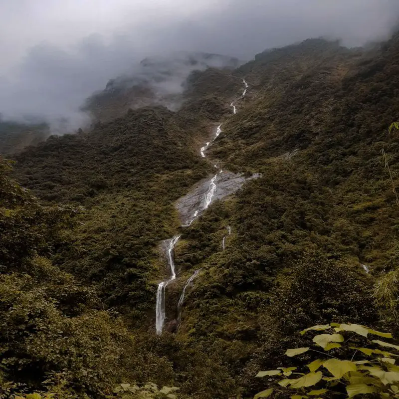

I have diverse experience as a data specialist, intern engineer, civil (hydrologic/hydraulic) engineer, and research assistant. During my undergraduate studies, I worked part-time as a data specialist. Completing undergraduate, I began working as an intern engineer, from which I was promoted to civil (hydrologic/hydraulic) engineer. After nearly three years of industrial working experience, I joined UConn for graduate studies and started working as a graduate research assistant.

I have a data-centric engineering background. I enjoy using computers/programming to make things simpler and efficient through computational thinking. I have a quantitative way of looking at things backed by statistics and mathematics. As a civil engineer, I have explored various terrains in Nepal for studies of hydropower and irrigation projects. Check out some of my shots!

|Narrow mountain foottrails|Waterfall in the trail of mount Dhaulagiri|
|:-:|:-:|
|||

Work Experience
======
**Graduate Research Assistant**, Aug 2022 - Present  
[Ecohydrology Lab](http://www.jamesknightonhydrology.com/), UConn, CT
* Big data analytics, Machine Learning
* Hydrological Modeling, Statistical Analysis
* Flood Risk Analysis, Socio-Hydrology, Impact of Climate Change
* R Programming, Python, ArcGIS pro & QGIS, Inkscape

**Civil (Hydraulic/Hydrologic) Engineer**, Jan 2020 - Jul 2022  
[Hydro-Consult Engineering](www.hcel.com.np), Nepal
* Hydrological analysis and hydraulic design for hydropower and irrigation projects
* Preparation of bill of quantity, civil drawings, and technical reports
* ArcGIS, AutoCAD, Civil3D, HEC-RAS, Excel with VBA, Microsoft Project

**Intern Engineer**, Sep 2019 - Dec 2019  
Hydro-Consult Engineering, Nepal
* Quantity estimation, rate analysis, and civil engineering drawing preparation

**Data Specialist**, Apr 2019 - Aug 2019  
[Cloud Factory](https://www.cloudfactory.com/), Nepal
* Data Analysis and Classification