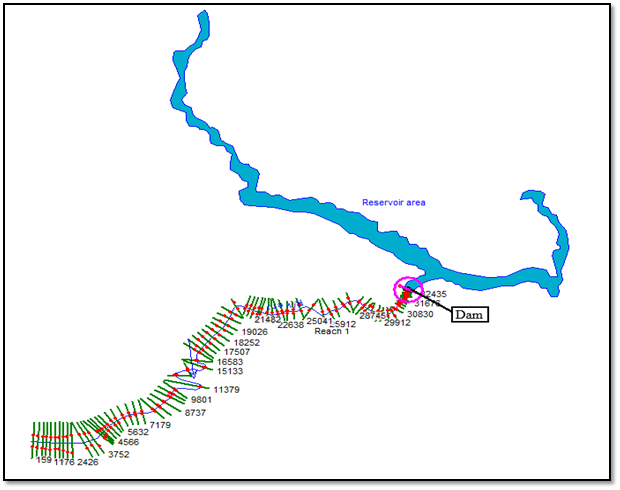

* Hydrological modeling, forcasting of hydrological extremes
* Flood risk, Socio-Hydrology
* Climate Change
* Big data analysis
* Machine Learning and Neural Networks

Research
======
**Projection of coastal housing market in a changing climate**

Flooding is a growing threat to the national economy and financial well-being. We used a socio-environmental model to study the impact of flooding in the coastal housing market of New York, New Jersey, and Connecticut, US. We incorporated the climate projection of precipitation (CMIP6), storm surge (Gumbel distribution), and sea level rise to 2100. We found a differential impact of flooding on communities based on social vulnerability, and the model predicts the housing market of the vulnerable communities could plummet and never recover due to sea level rise and hurricanes intensified by climate change.    

**Role of flood insurance, risk perception, and memory of flood in the dynamics of coastal housing market**

How flooding affects home values can determine the path of economic recovery for communities and have lasting impacts on national and global financial systems. Our Study found that initial economic impact of Hurricane Sandy was largely absorbed by the National Flood Insurance Program (NFIP); however, the region then exhibited a long-term decline in home values. Participation in the National Flood Insurance Program, communities' perception of risk, and the memory of past flooding events were important regional drivers of housing prices.  
[Related Article Published in Environmental Research Letters](https://iopscience.iop.org/article/10.1088/1748-9326/acea38/meta)  

*Schematic representation of three different housing price model.*

**Hydrologic modeling of dam breach scenario and flood inundation mapping**

This work is during my undergraduate studies. We performed an unsteady dam breach simulation of proposed Naumure Hydropower Project in HEC-RAS and prepared a flood inundation map showing the extent and depth of inundation for the study area. Our findings showed that the width of the breach played most important role in generating peak discharge relative to other breach characteristics. The simulation also revealed a significantly high discharge from the breach, indicating a potential flood risk in the residential area downstream.   

*Model representaion of reservoir and river cross section.*

