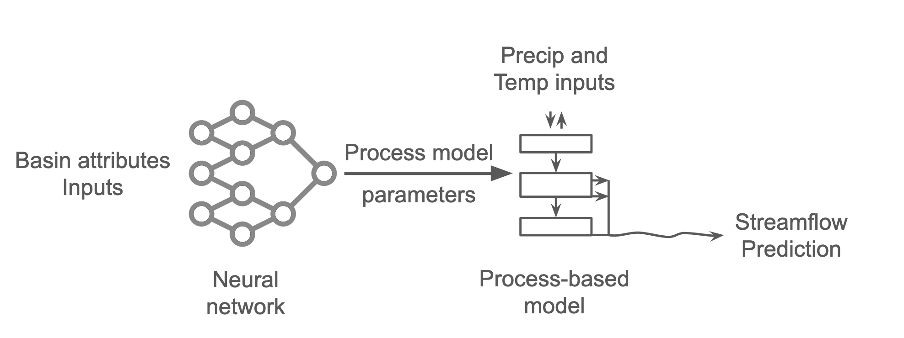
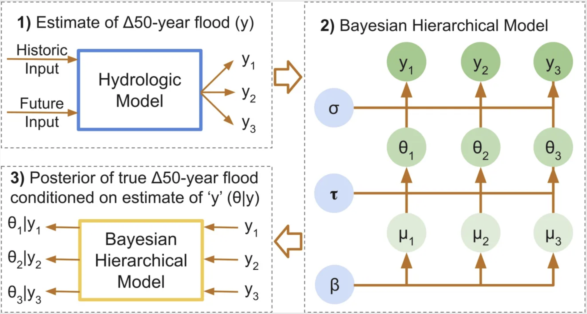
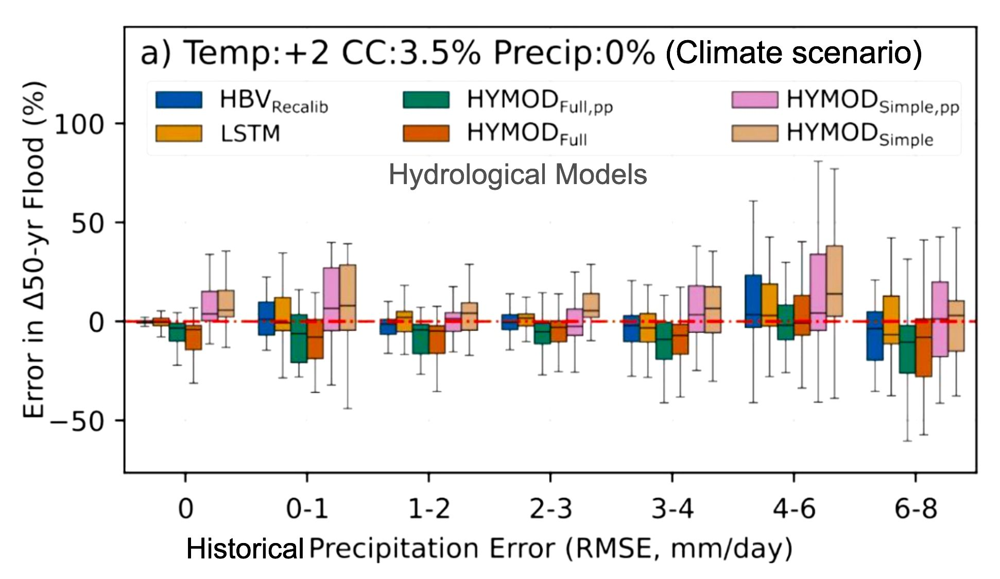
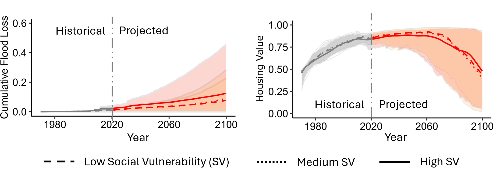
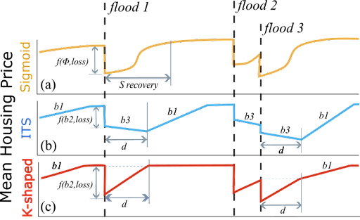

You can explore my published work on [Google Scholar](https://scholar.google.com/citations?user=wMsDspYAAAAJ&hl=en).  
You can also browse my projects on [GitHub Repositories](https://github.com/snpoudel).  
Below are some of the research projects I am currently working on, as well as those I have worked on previously.  

<strong>Physics-based machine learning in hydrology</strong>

A promising direction in physics-based machine learning for hydrology integrates neural networks for parameter learning with process-based hydrological models for simulation. These components are combined within a single framework that supports model development through gradient-based optimization. Such hybrid architectures can deliver higher predictive performance than traditional process-based models, provide improved interpretability through transparency of internal hydrological processes, and show strong potential for transfer learning in data-scarce regions and under changing climate conditions.

This project focuses on a deeper investigation of these hybrid architectures, with the goal of systematically evaluating their potential for out-of-sample prediction and their fidelity under altered input conditions, such as those expected under climate change.

{: .align-center}

<u> Related Links and Publications: </u>  

*In preparation*
 

<strong>Evaluation of attention-based LSTM models for improving streamflow predictions</strong>

Long Short-Term Memory (LSTM) networks have shown strong performance in streamflow prediction tasks. However, standard LSTM architectures can struggle to capture long-range dependencies in sequential hydrological data. Attention mechanisms offer a potential solution by enabling the model to focus selectively on the most relevant parts of the input sequence when generating predictions.

This project evaluates the effectiveness of attention-enhanced LSTM models in improving streamflow prediction accuracy compared to vanilla LSTM models.

[{: .align-center style="max-width:60%;"}](./_pages/attention_post.png)

<u> Related Links and Publications: </u>  

*In preparation*
 

<strong>Bayesian hierarchical modeling to reduce uncertainty in flood-change projection from deep learning and hybrid models</strong>

Flood-change projections under future climate scenarios carry substantial uncertainties. Yet, these projections are essential for designing water infrastructure and for long-term planning. This study applies a Bayesian hierarchical modeling framework to regionally pool information and produce more robust estimates of flood changes. By integrating results from deep learning and hybrid modeling approaches, the framework aims to reduce uncertainty and support resilient planning of water systems such as bridges, roads, and dams.  

{: .align-center}

<u> Related Links and Publications: </u>  

*Under review at Journal of Hydrologic Engineering*

*Water programming blog post:* [Uncertainty in Design Flood Change Projections and Ways to Reduce It](https://waterprogramming.wpcomstaging.com/2025/11/10/uncertainty-in-design-flood-change-projections-and-ways-to-reduce-it/)  

<strong>Uncertainty in estimating change of design floods using process-based, deep learning, and hybrid hydrological models</strong>

Designing future water infrastructure requires understanding how design-flood magnitudes may change under future climate conditions.

Hydrological models are commonly used to estimate these changes, but they carry substantial uncertainties. This study investigates the uncertainty in projecting changes in design floods across different types of hydrological models (process-based, deep learning, and hybrid) and under varying levels of input precipitation uncertainty.  

{: .align-center}

<u> Related Links and Publications: </u>  

*Publication in Journal of Hydrology:* [Uncertainty in estimating the relative change of design floods under climate change: a stylized experiment with process-based, deep learning, and hybrid models](https://www.sciencedirect.com/science/article/pii/S0022169425017676?via%3Dihub)  

<strong>Future of United States coastal housing market and the National Flood Insurance Program in a changing climate</strong>

Flooding caused by rising sea levels, intensified storm surges, and extreme rainfall has huge impacts on human-water systems, posing an increasing threat to the national economy and financial stability in the United States. We use socio-environmental models and climate emission scenarios and projected a substantial rise in flood damage, which could put the National Flood Insurance Program in a more tenuous position, and potentially raise the risk of a future housing market crash. Additionally, the flood risk is disproportionately distributed, with the most socially vulnerable populations facing the greatest danger. 

{: .align-center}

<u> Related Links and Publications: </u>  

*Publication in Nature Communication Earth & Environment:* [Differential flood insurance participation and housing market trajectories under future coastal flooding in the United States](https://www.nature.com/articles/s43247-024-01848-z)  

*Cover in UConn Today:* [US Flood Governance Drives Social Inequity and Maybe the Next Housing Market Crash](https://today.uconn.edu/2024/11/us-flood-governance-drives-social-inequity-and-maybe-the-next-housing-market-crash/)  

*Cover in Springer Nature:* [US Flood Governance Drives Social Inequity and Maybe the Next Housing Market Crash](https://communities.springernature.com/posts/us-flood-governance-drives-social-inequity-and-maybe-the-next-housing-market-crash#)  

*Presentation in CSDMS annual meeting:* [Flood Risk and Housing Market Dynamics Across CONUS Coastal Communities](https://csdms.colorado.edu/wiki/2024_CSDMS_meeting-105)  

<strong>Role of flood insurance, risk perception, and memory of flood in the dynamics of coastal housing market</strong>

How flooding affects home values can determine the path of economic recovery for communities and have lasting impacts on national and global financial systems. Our Study (for 1970 to 2021) in the coastal census tracts of New York, New Jersey, and Connecticut, US found that initial economic impact of Hurricane Sandy (2012, 3.5m MSL) was largely absorbed by the National Flood Insurance Program (NFIP); however, the region then exhibited a long-term decline in home values. Participation in the National Flood Insurance Program, communities' perception of risk, and the memory of past flooding events were important regional drivers of housing prices.  
{: .align-center}

<u> Related Links and Publications: </u>  

*Publication in Environmental Research Letters:* [Housing market dynamics of the post Hurricane Sandy are explained by NFIP participation](https://iopscience.iop.org/article/10.1088/1748-9326/acea38/meta)  

*Presentation in AGU fall meeting:* [Impact of Flooding on the Housing Market of New York, New Jersey, and Connecticut in a Changing Climate](https://agu23.ipostersessions.com/default.aspx?s=82-3E-C3-32-94-5C-33-AF-49-EE-BF-50-4C-1C-3D-D8)  